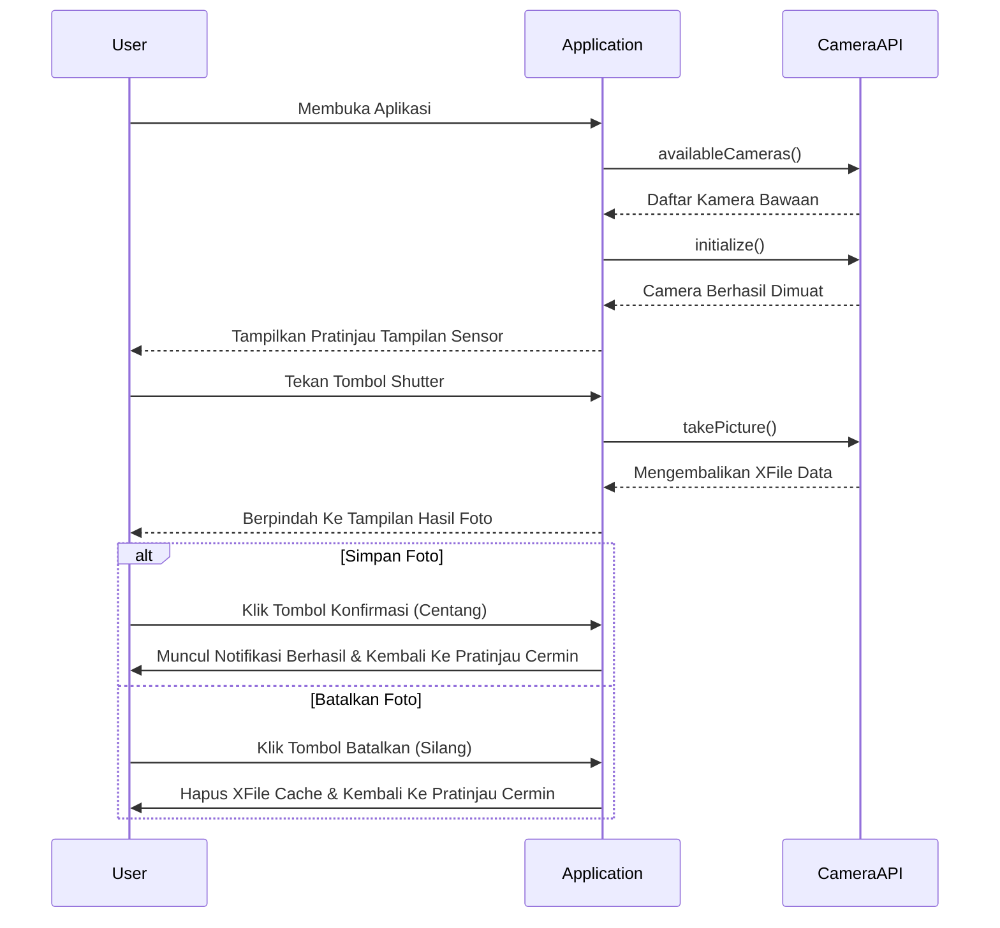

# -Tugas-7-Camera-API

## Identitas

| Informasi | Keterangan |
| --- | --- |
| Nama | Sulthonika Mahfudz Al Mujahidin |
| NIM | 1202230023 |
| Mata Kuliah | Aplikasi Perangkat Bergerak |

## Deskripsi

Proyek ini merupakan implementasi API Kamera pada aplikasi Flutter. Aplikasi ini dikembangkan untuk berjalan pada perangkat mobile, memungkinkan pengguna mengakses kamera bawaan (kamera depan maupun belakang), melihat pratinjau real-time, dan menangkap gambar. Desain antarmuka dibuat secara profesional dan minimalis agar memberikan pengalaman pengguna yang intuitif.

## Fitur Utama

- Tampilan pratinjau kamera real-time dengan sudut melengkung adaptif.
- Opsi untuk menangkap gambar melalui tombol "Shutter" dengan umpan balik visual.
- Dukungan untuk beralih antara kamera bagian depan dan kamera belakang.
- Layar pratinjau hasil tangkapan gambar sebelum disimpan.
- Antarmuka mode gelap (Dark Mode) yang konsisten dan terlihat elegan.

## Konsep yang Diterapkan

1. **State Management**: Memanfaatkan `StatefulWidget` untuk melacak siklus hidup (lifecycle) dari `CameraController` secara efisien dan memperbarui antarmuka secara dinamis sesuai dengan state kamera (belum terinisialisasi, aktif, atau menangkap gambar).
2. **Camera API Plugin**: Pengimplementasian menggunakan paket `camera` bawaan ekosistem Flutter. Paket ini memungkinkan kontrol penuh ke sensor fisik kamera tanpa harus meninggalkan komponen aplikasi.
3. **Penyimpanan XFile Sementara**: Hasil konversi dari tangkapan kamera disimpan dalam memori sebagai format `XFile`. Pembacaan gambar dilakukan secara asinkron (menggunakan byte data buffer) untuk menghindari kelebihan memori dan menjamin kompatibilitas silang perangkat.
4. **Desain Modular**: Arsitektur tampilan dipisahkan menjadi `_buildCameraScreen` (untuk perekaman langsung) dan `_buildPreviewScreen` (untuk peninjauan hasil perekaman).

## Alur Arsitektur



## Cara Menjalankan

Langkah-langkah untuk menjalankan repositori ini pada perangkat mobile:

1. Dapatkan semua dependensi paket:
   ```bash
   flutter pub get
   ```
2. Hubungkan perangkat mobile dan jalankan kompilasi:
   ```bash
   flutter run
   ```


